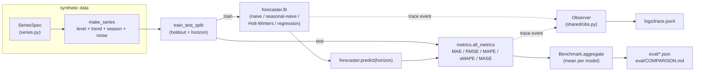

# forecast-toolkit

A small, dependency-light toolkit for forecasting seasonal time series. It
generates deterministic synthetic series, fits a handful of forecasters behind
a common interface, and backtests them on a holdout window with the usual point
metrics.

I built this mostly to have a clean place to compare classical baselines
(naive, seasonal-naive) against slightly smarter models (additive
Holt-Winters, ridge regression on calendar + lag features) without pulling in a
heavy stats stack. The Holt-Winters smoother is written directly on numpy.

## Layout

```
src/
  series.py        synthetic series generation + validation + presets
  base.py          the Forecaster interface
  forecasters.py   naive, seasonal-naive, Holt-Winters, regression
  metrics.py       MAE / RMSE / MAPE / sMAPE / MASE
  backtest.py      holdout split + benchmark harness
  registry.py      which models count as baseline vs improved
shared/            vendored structured-logging + seeding helpers
eval/              benchmark runner + generated comparison artifacts
tests/             unit / integration / determinism tests
docs/              design notes and a metric reference
```

## How it fits together



`registry.py` decides which model factories count as baseline vs improved,
and `eval/run_benchmark.py` is what actually drives the whole diagram end to
end.

## Quick start

```bash
python eval/run_benchmark.py
```

This writes `eval/baseline_results.json`, `eval/improved_results.json`,
`eval/comparison.json` and a readable `eval/COMPARISON.md`, and appends a JSONL
trace of every fit to `logs/trace.jsonl`.

Using a model directly:

```python
from src.series import SERIES_LIBRARY, make_series, train_test_split
from src.forecasters import HoltWinters

spec = SERIES_LIBRARY["retail_daily"]
y = make_series(spec, seed=137)
train, test = train_test_split(y, horizon=28)

model = HoltWinters(spec.period).fit(train)
forecast = model.predict(28)
```

Every forecaster follows the same `fit(train) -> self`, `predict(horizon)`
contract, so they are interchangeable in the backtest harness.

## Series

Three named presets live in `src/series.py`:

| name          | period | shape  | notes                              |
|---------------|--------|--------|------------------------------------|
| `retail_daily`| 7      | spiky  | weekly profile, mild upward trend  |
| `energy_load` | 7      | sine   | smooth weekly swing, slight decay  |
| `web_traffic` | 7      | spiky  | strong weekly peaks, steep trend   |

Each is `level + trend + seasonality + noise`, fully determined by the spec and
seed, so runs are reproducible.

## Results

Averaged over the three series at a 28-step holdout (seed 137):

| model          | MAE   | RMSE  | MAPE | sMAPE | MASE |
|----------------|-------|-------|------|-------|------|
| naive          | 77.60 | 94.70 | 8.03 | 7.83  | 2.58 |
| seasonal_naive | 36.29 | 45.22 | 3.49 | 3.48  | 1.11 |
| holt_winters   | 39.41 | 46.80 | 3.24 | 3.19  | 1.00 |
| regression     | 25.91 | 32.19 | 2.53 | 2.52  | 0.81 |

The ridge model on calendar + lag features comes out ahead on every metric, and
its MASE lands below 1 (so it beats the seasonal-naive scale). `eval/COMPARISON.md`
has the full table.

## Demonstration

Running the benchmark end to end:

```bash
$ python eval/run_benchmark.py
wrote eval artifacts to /path/to/forecast-toolkit/eval
improved wins on 5/5 metrics
```

That run regenerates `eval/comparison.json`, from which the summary line comes
straight out:

```json
"winner_by_metric": {
  "mae": "improved",
  "rmse": "improved",
  "mape": "improved",
  "smape": "improved",
  "mase": "improved"
}
```

Same numbers as the table above: regression's MASE of 0.805 against
seasonal-naive's 1.113 is the clearest single result, it's forecasting at
about 72% of seasonal-naive's error on the scaled metric.

## Tests

```bash
python -m pytest
```

Covers series generation, each forecaster, the metrics, an end-to-end backtest,
and determinism (same seed reproduces identical forecasts and metrics across
repeated runs). The suite leans on real sklearn fits so it takes a couple of
minutes to run in full.

## Writing hygiene

`scripts/check_prose.py` is a small stdlib-only script that scans tracked
markdown and Python files for em-dashes, leaked tool-call artifacts, and a
short list of keywords that shouldn't be in this repo. Run it by hand with
`python scripts/check_prose.py`, it isn't wired into a git hook or CI.
